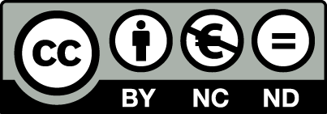

---

marp: true
theme: gaia
pagination: true
class: invert
size: 4:3

---

# <!-- fit --> Challenges in identifying and utilizing the OERs.

*There is inadequate perception among teacher educators on availability and usability of relevant OER for teaching the contents.
* Teacher Educators are varied on their perception regarding OER as relevant and active support to teach content.
* 18% of teacher educators perceived the OER as need of the hour while
* 13.88% perceived OER as not supportive.
* 68% perceived with neutrality.
* 82% of teacher educators are skeptic on authenticity of available online resources including OER materials.

---

# Teachers Perception

 * Most of the teachers guarantee the credibility of online resources only after verifying with the text book resources.
 * They have 'tendency to compare' the relevance and quality of online materials with Books.
 * The study reflects need of awareness programmes for teacher educators on OER and its utilization. 
 * Curation is needeed to adjudicate the credence and quality of the materials.
Journal of Educational Technology, v15 n2 p55-61 Jul-Sep 2018

---

# Curation vs Creation Dilema

* You mostly likely already engage in a mix of content creation and content curation.
* Content creation is when you create your own materials from scratch—from syllabi, presentations, assignments and assessments.
* You realize that you’re a one-stop shop education machine!.
* You don’t write your own new course materials every semester. 
* Instead, you think about the use of existing content where it suits your needs.

---

# What to do?

* Skip some readings and borrow material from a past semester. This is content curation.
* Balancing content creation with curation makes course design more effective.
* Content curation means take resources developed by trusted sources and use them in their own classes.
* Curation is just one educational tool.
* Research shows that curation also improves student success while keeping student costs low with free or affordable supplemental materials.
* Curating high-quality content prevents you from unnecessarily duplicating content (MMOER). 

---

# OER Curation

[OER Curation Kit](https://www.education.ne.gov/educational-technology/oer/oer-toolkit-curation/#1550863946581-1fce08bd-2c1b)

* Consider collaborating with others

* Conduct your searches in recognized repositories

* Become familiar with open licensing and accessibility requirements

* Determine your evaluation criteria

---

# Recommendations

- Limit the amount of copyrighted materials posted to Moodle

- Use links to legal copies of materials, rather than creating and uploading copies to Moodle. Reasons linking is preferable include:

- Consider this a teachable moment: teach to find

- Using films and music within Moodle carefully

- Delete copyrighted content after the class ends

---

<!-- class: lead -->

# <!-- fit --> Thank you!
## Creative Commos License
 

---
